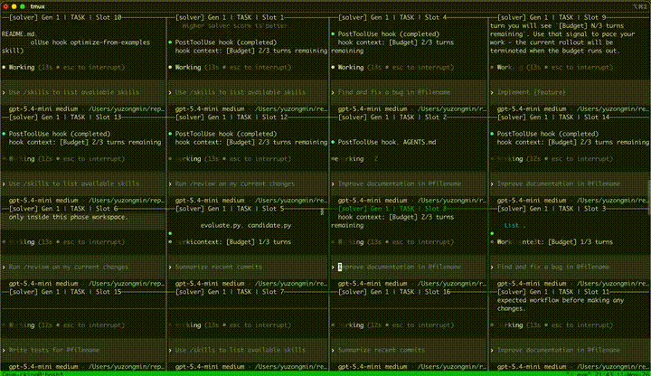
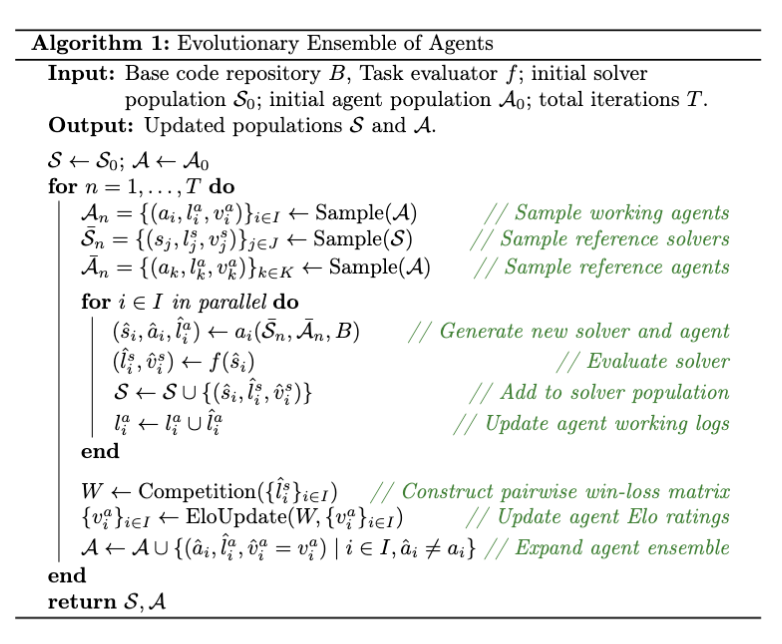
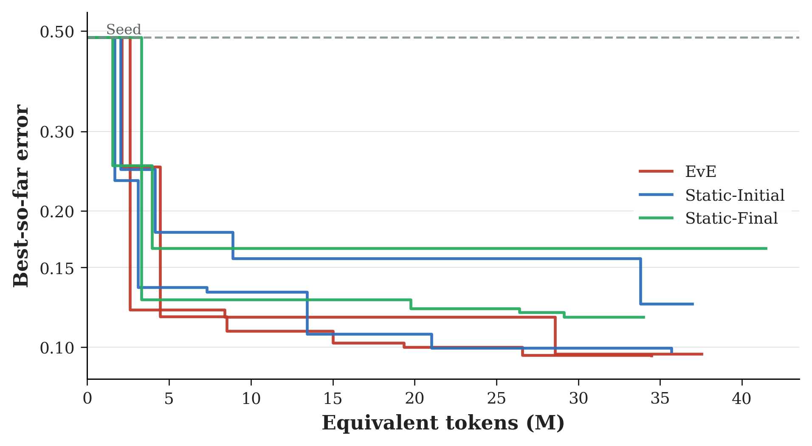

<div align="center">


# EvE: Evolutionary Ensemble of Agents

### **A decentralized ensemble of coding agents co-evolving with code repositories.**

[](https://www.python.org/)
[](https://hydra.cc/)
[](https://docs.astral.sh/ruff/)<br>
[](https://arxiv.org/abs/2605.09018)
[](LICENSE)
[](https://github.com/scaling-group/eve/pulls)

[Scientific Computing and Intelligence Group (Scaling Group) @ NUS](https://scaling-group.github.io)

</div>

<p align="center">
<a href="https://arxiv.org/abs/2605.09018">Paper</a> &middot; <a href="#overview">Overview</a> &middot; <a href="#supported-agents">Supported Agents</a> &middot; <a href="#how-it-works">How It Works</a> &middot; <a href="#quick-start">Quick Start</a> &middot; <a href="#example-icon-context-length-generalization">Example</a> &middot; <a href="#citation">Citation</a>
</p>

<p align="center"><b>Unlimited agents, fully autonomous.</b></p>

<p align="center">
  
</p>
<p align="center">
  <sub>Each tmux pane is an independent coding agent editing, evaluating, and evolving solutions.</sub>
</p>

## Overview

Modern coding agents already have autonomous planning, complex reasoning, sophisticated context management, and sub-agent invocation. Rather than reinventing the wheel with "LLMs as optimizers", **EvE wraps existing, highly capable coding agents into a decentralized evolutionary ensemble** that co-evolves two populations: a **solver population** of functional components within a code repository, and an **agent population** whose guidance and skills are continuously refined through pairwise competition.

Any coding agent or multi-agent system can be seamlessly encapsulated as an individual within the ensemble. This naturally supports **recursive nesting**: an entire EvE ensemble can function as a single individual inside a higher-level ensemble.

<p align="center">
  
</p>
<p align="center">
  <sub><b>(a)</b> LLM as Optimizer: an LLM proposes a code block, which is scored and re-prompted. <b>(b)</b> Coding Agent: operates on a full code repository with autonomous planning, tool use, and sub-agent invocation. <b>(c)</b> Evolutionary Ensemble (this work): a decentralized ensemble of coding agents that evolves with another population of functional components within a code repository.</sub>
</p>

## Supported Agents

EvE works with any coding agent that exposes a CLI. Currently supported:

| Agent                                                        | Description                         |
| ------------------------------------------------------------ | ----------------------------------- |
| [**Codex**](https://github.com/openai/codex)                 | OpenAI's coding agent (recommended) |
| [**Claude Code**](https://github.com/anthropics/claude-code) | Anthropic's coding agent            |

Codex is the primary development and testing target for EvE. Claude Code is supported but may lag behind on new features.

Both agents support two modes:

- **Interactive (tmux)**: each agent session runs in a visible tmux pane, exactly like using Codex or Claude Code in your terminal. You can watch agents think, intervene, and debug in real time. Best for development and research runs.
- **Non-interactive (subprocess)**: agents run as headless subprocesses with JSON streaming. Best for unattended production runs and CI.

Agents can be powered in two ways:

- **Subscription**: Codex is included with a ChatGPT subscription; Claude Code is included with a Claude subscription. No API key needed.
- **API**: Both agents also support pay-per-token API access. Third-party providers (DeepSeek, OpenRouter) are supported through provider routing.

## First-time Setup

1.  **Agent authentication.** Install and authenticate your coding agent
    (e.g. `codex login` for Codex if you use a ChatGPT subscription, or copy `.env.example` to `.env` and
    fill in API keys).

2.  **Hook trust (for Codex >= 0.130.0).** EvE uses hooks for workspace
    sandboxing and budget prompts. Run once per machine from the repository root if you are using codex:

         uv run python -m scaling_evolve.providers.agent.codex_hooks
         codex
         # Type /hooks -> press t to trust all -> Esc -> Ctrl-C

3.  **Verify.** Run a short smoke test using codex to confirm everything works:

         uv run python -m scaling_evolve.algorithms.eve.runner \
           --config-name=circle_packing.smoke

    This runs a 3-iteration circle packing demo with headless Codex agents.
    Add `driver=codex_tmux` to watch agents work in real time (opens a tmux
    session; works best in iTerm2 on macOS).

## How It Works

<p align="center">
  
</p>

EvE maintains two co-evolving populations: a **solver population** containing functional components in a code repository, and an **agent population** where each agent carries cumulative working logs and an Elo-based score. EvE fixes the base agent substrate (e.g. Codex, Claude Code) and focuses entirely on evolving the cumulative guidance and skills that dictate agent behaviors.

Each agent operates in a dedicated workspace with all dependencies included, and its modification scope is explicitly restricted to designated files and enforced by rigorous post-generation checks. Solver improvement and self-referential agent optimization happen in one unified step: agents improve guidance and skills while editing code repositories, and this guidance is then repeatedly evaluated during future iterations, with concrete scores that drive sampling probability. Knowledge sharing occurs on two levels: agents observe prior solver attempts from their peers, and agents continuously generate guidance and skills that take existing agents and their logs as references.

The formal procedure is given in the algorithm below.

<details>
<summary><b>Algorithm: Evolutionary Ensemble of Agents</b> (click to expand)</summary>
<br>
<p align="center">
  
</p>

In each iteration, EvE samples a set of high-performing working agents, along with reference sets of solvers and agents, which are combined with the base code repository to provide context. A "synchronous race" is then conducted: each working agent operates within its own workspace on the same reference set, producing a new solver candidate and a potentially revised agent. By forcing all agents to refine the same references, the variance in solver quality is directly attributed to the effectiveness of each agent's strategy. After evaluation, a pairwise win-loss matrix is constructed and agent Elo ratings are updated. Agents that revised their guidance are integrated back into the population, preserving new strategies and their underlying procedural evidence, including reasoning traces and failed attempts.

</details>

## Quick Start

```bash
uv sync

# Try the built-in circle packing demo (3 iterations short run)
uv run python -m scaling_evolve.algorithms.eve.runner --config-name=circle_packing.smoke
```

## Set Up Your Own Task

To run EvE on your own codebase, you need the following things: a source repo, an application config, initial guidance, and a top-level experiment config.

### 1. Application config

Point EvE at your code repository, declare which files agents may edit, and provide an evaluation script that scores each candidate:

```yaml
# configs/eve/application/your_task.yaml
application:
  name: your-task
  github_url: https://github.com/your-org/your-repo
  commit: abc123... # pin to a specific commit
  editable:
    files: # the mutation surface
      - src/model.py
      - configs/params.yaml
    folders: [] # or list directories agents may edit
  evaluation_steps:
    - configs/eve/application/your_task/evaluation.sh
```

The evaluation script runs inside the candidate workspace and must write a `score.yaml` (with `score: <float>` and `summary: <string>`) to the evaluation log directory. Agents are strictly confined to `editable.files`; any modification outside this surface is rejected by the boundary checker.

See [`configs/eve/application/circle_packing/`](configs/eve/application/circle_packing/) for a minimal single-file example, or [`configs/eve/application/icon/`](configs/eve/application/icon/) and [`examples/icon/`](examples/icon/) for a full external-repo setup with remote GPU evaluation. All EvE configurations live under [`configs/eve/`](configs/eve/).

### 2. Initial guidance

Write Markdown documents that describe the task and search directions for the agents. Place them in an `initial_optimizer/` directory:

```
configs/eve/optimizer/your_task/initial_optimizer/
  docs/                          # task context, search directions, background knowledge
  skills/
    your-skill/SKILL.md          # reusable instructions agents will read and evolve
```

All files under `initial_optimizer/` are what the agent population evolves over time. As agents discover what works and what doesn't, they revise the guidance for future iterations. You can include any combination of `docs/` and `skills/` that fits your task.

```yaml
# configs/eve/optimizer/your_task.yaml
optimizer:
  initial_optimizer: configs/eve/optimizer/your_task/initial_optimizer
  evaluation:
    _target_: scaling_evolve.algorithms.eve.populations.evaluators.elo.ScalarEloEvaluator
    k_factor: 32.0
    initial_score:
      elo: 1500.0
```

### 3. Experiment config

Compose everything with Hydra and launch:

```yaml
# configs/eve/your_task.yaml
defaults:
  - runtime: default
  - loop: default
  - prompt: default
  - driver: codex_tmux # see configs/eve/driver/ for all options
  # - driver: codex_noninteractive  # headless Codex
  # - driver: claude_tmux           # interactive Claude Code
  # - driver: claude_noninteractive # headless Claude Code
  - logger: many_loggers
  - application: your_task
  - optimizer: your_task

label: your-task
```

```bash
uv run python -m scaling_evolve.algorithms.eve.runner --config-name=your_task
```

The driver can also be switched at launch time without editing the config:

```bash
uv run python -m scaling_evolve.algorithms.eve.runner \
  --config-name=your_task driver=claude_tmux
```

See `configs/eve/circle_packing.yaml` and `configs/eve/icon.yaml` for complete working examples.

## Example: ICON Context Length Generalization

Applied to [ICON](https://github.com/scaling-group/icon-core) (In-Context Operator Networks), EvE autonomously discovered a novel positional-encoding mechanism that reduced generalization error by over 80% compared to the hand-designed baseline, turning a catastrophic out-of-distribution failure into robust performance. This application uses EvE's external-repo mode with remote GPU evaluation. See `examples/icon/README.md` for reproduction instructions.

We compare three experimental conditions, each run twice independently under identical compute budgets:

- **EvE**: the full ensemble with continuous agent evolution.
- **Static-Initial**: the initial agent is used throughout the entire search, with no agent evolution.
- **Static-Final**: the single best-rated agent from the corresponding completed EvE run is extracted and frozen for a fresh search.

<p align="center">
  
</p>
<p align="center">
  <sub>Search trajectories for all variants (two independent runs each). The y-axis is the running minimum of mean error (lower is better); the x-axis is cumulative equivalent tokens in millions. The gray dashed line marks the Seed baseline.</sub>
</p>

The two EvE runs descend in near-lockstep, converging to almost identical final errors. The Static-Initial runs diverge: one eventually approaches EvE while the other plateaus at a higher level. Static-Final, despite starting from a higher-rated agent, suffers from phase mismatch: the frozen agent was optimized for the late stage of the original EvE run but a fresh search requires early-stage exploration strategies that this agent no longer carries. Continuous evolution is indispensable for both performance and robustness.

## Citation

```bibtex
@article{yu2026eve,
  title         = {Evolutionary Ensemble of Agents},
  author        = {Yu, Zongmin and Yang, Liu},
  year          = {2026},
  url           = {https://arxiv.org/abs/2605.09018},
  eprint        = {2605.09018},
  archivePrefix = {arXiv},
  primaryClass  = {cs.NE}
}
```

## Acknowledgement

This project is part of the [Scientific Computing and Intelligence Group (Scaling Group)](https://scaling-group.github.io) at the National University of Singapore.

Please include the NOTICE file (already included in this repository) in your code base that uses this repository.
